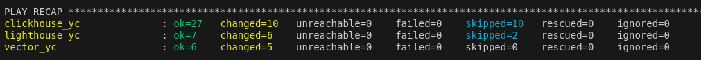

[Задание](https://github.com/netology-code/mnt-homeworks/blob/MNT-video/08-ansible-04-role/README.md)
---

- В качестве "отправной точки" использовано прошлое [ДЗ](https://github.com/SergueiMoscow/Ansible_03)
- Добавлен файл [`requirements.yml`](playbook/requirements.yml) с предложенным содержимым
- Создано 2 роли:  
`ansible-galaxy role init vector-role`  
`ansible-galaxy role init lighthouse-role`  
- Заполнены [vector handler](https://github.com/SergueiMoscow/Ansible_vector_role/blob/main/handlers/main.yml) и [clickhouse handler](https://github.com/SergueiMoscow/Ansible_lighthouse_role/blob/1.0.0/handlers/main.yml) из содержимого тасок в [site.yml](playbook/site.yml)
- Заполнены таски [vector](https://github.com/SergueiMoscow/Ansible_vector_role/blob/main/tasks/main.yml) и [lighthouse](https://github.com/SergueiMoscow/Ansible_lighthouse_role/blob/1.0.0/tasks/main.yml) также из содержимого [site.yml](playbook/site.yml)
- Заполнены meta и README файлы, перенесены переменные.
- Закоммичены, запушены, протеганы оба проекта ролей.
- Playbook переработан на использование roles.
---
Репозитории:
- [vector](https://github.com/SergueiMoscow/Ansible_vector_role/tree/1.0.0)
- [lighthouse](https://github.com/SergueiMoscow/Ansible_lighthouse_role/tree/1.0.0)

были попытки запуска плейбука с контейнерами, но все они валились на clickhouse:

---
+ C контейнером almalinux, с которым я раньше работал, эта роль не сработала.
+ Согласно meta/main.yml, сменил контейнер на debian, упал с ошибкой, что не находит python.
+ Взял контейнер с python (python:3.12-slim-bookworm) - упал с ошибкой, не находит gpg.
+ Создал Dockerfile.debian  c установкой gpg - упал с ошибкой:  
```
TASK [clickhouse : Install by APT | Apt-key add repo key] **********************************************************************************
fatal: [clickhouse_c]: FAILED! => {"changed": false, "cmd": "/usr/bin/apt-key adv --no-tty --keyserver keyserver.ubuntu.com --recv 8919F6BD2B48D754", "forced_environment": {"LANG": "C.utf8", "LC_ALL": "C.utf8", "LC_MESSAGES": "C.utf8"}, "msg": "Error fetching key 8919F6BD2B48D754 from keyserver: keyserver.ubuntu.com", "rc": 2, "stderr": "Warning: apt-key is deprecated. Manage keyring files in trusted.gpg.d instead (see apt-key(8)).\ngpg: error running '/usr/bin/dirmngr': probably not installed\ngpg: failed to start the dirmngr '/usr/bin/dirmngr': Configuration error\ngpg: connecting dirmngr at '/tmp/apt-key-gpghome.4NzaLqanBD/S.dirmngr' failed: Configuration error\ngpg: keyserver receive failed: No dirmngr\n", "stderr_lines": ["Warning: apt-key is deprecated. Manage keyring files in trusted.gpg.d instead (see apt-key(8)).", "gpg: error running '/usr/bin/dirmngr': probably not installed", "gpg: failed to start the dirmngr '/usr/bin/dirmngr': Configuration error", "gpg: connecting dirmngr at '/tmp/apt-key-gpghome.4NzaLqanBD/S.dirmngr' failed: Configuration error", "gpg: keyserver receive failed: No dirmngr"], "stdout": "Executing: /tmp/apt-key-gpghome.4NzaLqanBD/gpg.1.sh --no-tty --keyserver keyserver.ubuntu.com --recv 8919F6BD2B48D754\n", "s
```
+ С контейнерами запуск решил прервать, и тестировать на Yandex Cloud, для чего поменял немного переменные в terraform, чтобы image для clickhouse был на основе Ubuntu. Так сработало.  

---
